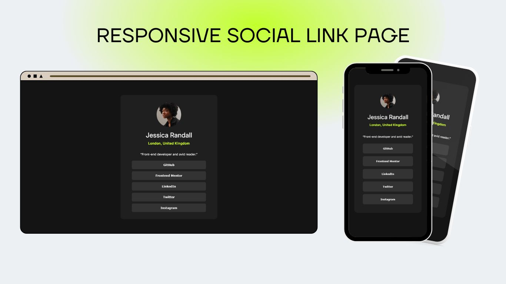

# Frontend Mentor - Social links profile solution

## Table of contents

- [Frontend Mentor - Social links profile solution](#frontend-mentor---social-links-profile-solution)
  - [Table of contents](#table-of-contents)
  - [Overview](#overview)
    - [The challenge](#the-challenge)
    - [Screenshot](#screenshot)
    - [Links](#links)
  - [Tech Stack](#tech-stack)
    - [Built with](#built-with)

## Overview

### The challenge

Users should be able to:

- See hover and focus states for all interactive elements on the page

### Screenshot

### Links

- Solution URL: [View Here](https://github.com/nsaaus/social-link-page)
- Live Site URL: [View Here](https://nsaaus.github.io/social-link-page/)

## Tech Stack

This website is built using the following technologies:

### Built with

- Semantic HTML5 markup
- CSS custom properties
- Flexbox
- Google Fonts
